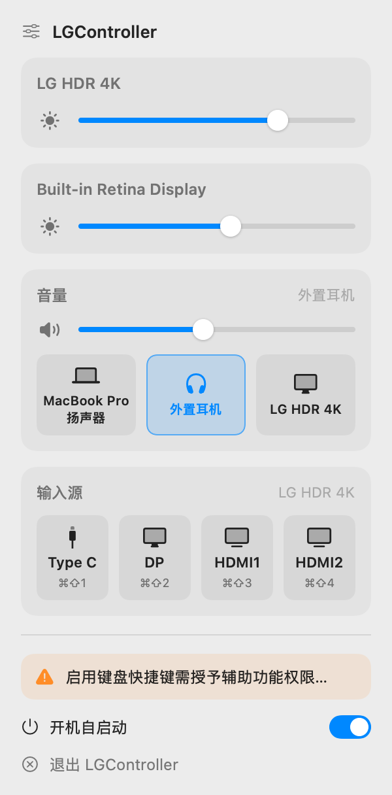

# LGController 功能说明与使用手册

LGController 是一个只驻留在菜单栏的 macOS 小工具：用 Mac 键盘的亮度/音量键和菜单栏弹窗，控制 LG 外接显示器（以及其他支持 DDC/CI 的显示器）与内建显示器的亮度、当前声音输出设备的音量，切换系统声音输出，并通过 `⌘⇧1`～`⌘⇧4` 切换 LG 显示器的输入源。它由 Monitoring（亮度/音量）与 SourceShift（LG 输入源切换）两个项目合并而来，取代了这两个 App。

English version: [USER_GUIDE.en.md](USER_GUIDE.en.md) · 适用版本：1.0.0（build 1）

> App 界面只有简体中文。本手册直接引用界面上的中文文字，例如「开机自启动」。

---

## 第一部分 功能说明

### 概览

| 控制对象 | 方式 |
|---|---|
| 内建显示器、苹果显示器（Studio Display、雷雳版 UltraFine 等）的亮度 | Apple 私有框架 DisplayServices |
| LG 及其他外接显示器的亮度 | DDC/CI，VCP `0x10` |
| 耳机、AirPods、内建扬声器、USB 音频等的音量/静音 | CoreAudio |
| 显示器自带扬声器（DP/HDMI 音频）的音量/静音 | DDC/CI，VCP `0x62`（音量）/ `0x8D`（静音） |
| 系统默认声音输出设备 | 弹窗里的输出源按钮（设置 CoreAudio 默认输出） |
| LG 显示器输入源（Type C / DP / HDMI1 / HDMI2） | LG 私有 VCP `0xF4`（只写） |

**运行要求一览**

- macOS 12.0 或更高。只有菜单栏图标，没有 Dock 图标，也没有主窗口。
- **Apple Silicon 或 Intel Mac**：用到 DDC 的功能（LG 亮度、LG 扬声器音量、输入源切换），在 Apple Silicon 上通过 IOAVService 实现，在 Intel Mac 上通过显卡帧缓冲的 I²C 总线实现（**Intel 为试验性支持**，尚未在真机上充分验证）。匹配不到 DDC 通道的外接屏，其卡片显示「亮度不可控」。
- 没有预编译安装包，需要用 `./build.sh` 从源码构建，这需要 Xcode Command Line Tools（见第二部分第 2 节）。
- 「辅助功能」权限只有亮度/音量/静音键需要；其他功能（包括 `⌘⇧1`～`⌘⇧4`）都不需要。

### 亮度

- **按键**：亮度减 / 亮度加（Mac 键盘上的 F1 / F2）调节**鼠标指针所在的显示器**，并在该屏显示浮层（HUD）和新数值。
- **调哪块屏**：
  - 指针在镜像从属屏上时，调节它镜像的主屏。镜像从属屏和虚拟显示器没有自己的卡片，也不单独控制。
  - 指针不在任何已识别的屏上（例如在虚拟显示器上）或无法判断时，使用列表中的第一台显示器（外接屏排在内建屏之前）。
- **通道**：内建屏，以及 DisplayServices 能读到亮度的显示器（Studio Display、雷雳版 UltraFine 等），走 DisplayServices；其他外接屏走 DDC/CI。DDC 显示器使用其上报的最大值，读不到时按 100 处理。
- **步进**：亮度分为 16 档。每按一下移到下一条 1/16 网格线——向上取严格更高的那条，向下取严格更低的那条。当前值落在两条线之间（例如从硬件读回的值）时，第一下先对齐到相邻的线，因此从任意值出发，按几下一定正好到 0% 或 100%。例：21% 向下 → 3/16（18.75%），21% 向上 → 4/16（25%），25% 向上 → 31.25%，3% 向下 → 0%，97% 向上 → 100%。
- **精细步进**：`⌥⇧` + 亮度键 = 1/64 一档。
- **平滑过渡**：按键和滑杆的亮度变化都会平滑过渡（约 60 Hz 指数趋近），而不是跳变；DDC 链路较慢时按显示器能接受的写入速度进行。
- **不可控时交还系统**：如果鼠标所在显示器没有可用通道（没有匹配到 DDC 通道，或 DisplayServices 不可用），亮度键原样交给 macOS 处理，该屏卡片显示「亮度不可控」。
- **苹果显示器漂移**：对内建屏和苹果显示器，每次按亮度键前、以及打开弹窗时，会重新读取真实亮度（前提是 App 在最近 3 秒内没改过它），以吸收自动亮度或系统原生控制造成的变化。

### 音量与静音

音量加、音量减和静音键（F12、F11、F10）**跟随「当前声音输出设备」**（系统默认输出），与鼠标在哪块屏无关。目标按以下顺序确定：

1. 默认输出设备可由 CoreAudio 调节音量（耳机、AirPods、内建扬声器、USB 音频）→ 用 CoreAudio 调它。
2. 默认输出无法由 CoreAudio 调节、但能对应到**唯一一台**可 DDC 调音量的显示器 → 通过 DDC 调那台显示器的扬声器。对应方式：按名称匹配（忽略大小写和空格的精确匹配优先，其次是一方名称包含另一方）；如果名称对不上、输出是 DP/HDMI 音频、且系统里只有一台可 DDC 调音量的显示器，直接认定是它。
3. 否则，如果鼠标所在屏是可 DDC 调音量的显示器 → 调它的扬声器。
4. 否则，如果输出是 DP/HDMI 显示器音频（只是认不出是哪台）→ 不可调。
5. 否则，如果内建扬声器可调 → 调内建扬声器。
6. 以上都不满足 → 不可调。

**耳机、AirPods、内建扬声器、USB 音频（CoreAudio）**

- 每按一下 1/16（`⌥⇧` = 1/64），规则与亮度相同，从 App 自己记录的目标值出发，因此能正好到 0 或 100%。
- 调到 0 即真正静音：音量设为 0，同时打开设备的硬件静音。
- 静音是独立状态，会记住静音前的音量：任意音量键（加或减）都会解除静音，并从记住的音量开始步进（与 macOS 相同）。
- 静音键切换静音；从 0 解除静音时恢复静音前的音量（至少 1/16）。
- 静音期间浮层和弹窗显示 0。
- 其他 App、控制中心或菜单栏音量条改过音量时，只要差异超过 2%，下一次步进前会先采用真实值。
- App 不保存这些音量，由设备自己记住。

**显示器扬声器（DDC）**

- 每按一下正好 ±1 个 DDC 原始单位，满格为显示器上报的最大值；LG 为 100，即每按 ±1%。`⌥⇧` 在这里无效。
- 静音与音量 0 等价：静音后显示 0；减到 0 自动静音。
- 静音时按音量加从 0 变为 1 个单位并解除静音；按音量减则保持 0 和静音。再按静音键恢复静音前的音量（至少 1 个单位）。
- 滑杆拖到 0 即静音。
- 快速连续调节会合并，只写最新值，两次 DDC 写入间隔约 50 ms。

**静音键**：只响应第一次按下，按住产生的重复和松开都被吞掉（不交给 macOS）。浮层显示调节后的音量，静音时为带斜线的扬声器。

**不可调时**：按键仍会被 App 拦截，什么也不改变。音量键的浮层显示带斜线的圆形扬声器图标和空进度条、无文字；静音键显示同一图标的实心版。声音走向一台 App 认不出的显示器时，App **不会**转而去调内建扬声器。但如果输出对应不上、而鼠标在一台可 DDC 调音量的显示器上，按键会调那台显示器的扬声器（规则 3），即使声音并不从那里出（例如使用多输出设备时）。

**两台同名显示器**（例如两台「LG HDR 4K」）无法通过音频设备名区分。此时 App 不猜：音量键调鼠标所在的那台 DDC 显示器；鼠标在内建屏或苹果显示器上时显示「不可调」浮层。弹窗「音量」卡片会提示到显示器卡片里调（见「菜单栏弹窗」）。

**反馈音**：松开音量键时，如果调节后的音量大于 0 且未静音，播放 macOS 标准的音量提示音；静音键解除静音后也播放。按键自动重复、拖动弹窗滑杆、以及音量不可调时不播放。遵循系统设置「更改音量时播放反馈」（英文系统为 “Play feedback when volume is changed”；偏好键 `com.apple.sound.beep.feedback`，值为 0 时不播放，未设置时播放）。声音为系统自带的 `volume.aiff`（BezelServices）；系统里没有这个文件时不播放。

### 声音输出切换

弹窗「音量」卡片的滑杆下方是输出源按钮（自适应网格），每个声音输出设备一个。

- **列出哪些设备**：所有能输出声音、未隐藏、可设为默认输出的音频设备，顺序为 CoreAudio 的设备枚举顺序（不一定与「系统设置 → 声音」相同）。声明自己不能设为默认输出的设备不列出，常见于会议/录屏软件的辅助虚拟设备。
- **当前输出源**：以强调色高亮。
- **切换**：点击某个按钮即把它设为系统默认输出设备；点击当前项无反应。只改默认输出，**不改「播放声音效果的设备」**。
- **重名设备**：同名设备（如两台同型号显示器的 DP 音频）后面加「 · 音频1」「 · 音频2」区分。这个序号与 macOS 给显示器的编号无关，不能用它判断是哪台显示器。
- **悬停提示**：当前项「当前输出源：<名称>」，其他项「切换声音输出到 <名称>」。
- **图标**：

| 设备 | 图标（SF Symbol） |
|---|---|
| 蓝牙设备，名称含 “AirPods” | `airpods` |
| 其他蓝牙设备 | `headphones` |
| DisplayPort / HDMI（显示器音频） | `display` |
| USB / 雷雳 | `hifispeaker` |
| AirPlay | `airplayaudio` |
| 内建设备，名称含 “headphone” 或 “耳机” | `headphones` |
| 其他内建设备 | `laptopcomputer` |
| 其他 | `speaker.wave.2` |

### 输入源切换（LG）

| 快捷键 | 输入源 | LG 代码（VCP `0xF4`） |
|---|---|---|
| `⌘⇧1` | Type C（USB-C / 雷雳） | `0xD1` |
| `⌘⇧2` | DP | `0xD0` |
| `⌘⇧3` | HDMI1 | `0x90` |
| `⌘⇧4` | HDMI2 | `0x91` |

- **全局快捷键**：任何 App 在前台都有效，**不需要辅助功能权限**。使用主键盘数字行的 1～4，小键盘无效。快捷键写死在代码里，不能在 App 内修改。同样的四个输入源也是弹窗「输入源」卡片里的按钮。
- **始终有效**：快捷键从不暂停。显示器休眠、刚唤醒、显示器重新配置期间都能用，因此可以在显示器正显示其他设备时「盲按」切回。
- **目标显示器**：鼠标所在的可 DDC 外接屏（用弹窗按钮时即弹窗所在的屏，见第二部分第 6 节）；否则列表中第一台可 DDC 外接屏。定向发送时，内建屏、苹果显示器、镜像从属屏和虚拟显示器不会被选为目标。
- **找不到目标时**：如果列表里没有可 DDC 的外接屏（常见原因：显示器切走后从系统中消失），命令盲发到 Mac 仍有的所有外接 I²C 端点，不区分是哪台显示器；一个都没有时，再写系统默认 AVService。盲发不重试。
- **命令格式**：命令写到 DDC 数据地址 `0x50`（不是标准的 `0x51`），例如 Type C = `84 03 F4 00 D1 9C`。每条命令连写两遍，间隔约 10 ms；第一遍未被确认就不再写第二遍。
- **等总线空闲**：发送前等该屏 DDC 链路静默至少 250 ms（例如刚打开弹窗就点，会先等弹窗的回读完成），因此可能有短暂延迟。
- **「已发送」≠「已切换」**：该寄存器只写不可读，显示器无法报告当前输入。显示器在 I²C 层确认收到后，浮层显示「已发送切换 → <输入源>」，例如「已发送切换 → HDMI1」；是否真的切换以显示器画面为准。
- **重试**：定向发送未被确认时，先在同一台屏上重试一次；仍失败则为这台屏重新匹配 I²C 端点再发一次——只接受能确认属于这台屏的端点，绝不写到其他显示器。仍失败则响提示音，浮层显示「<输入源> 未送达显示器」。
- **连续请求**：同一台屏上的新请求会让旧请求放弃尚未开始的重试（放弃的旧请求不显示浮层、不响提示音），因此迟到的重试一般不会把输入改回去。已经发出的旧写入不会撤回；极少数情况下（旧请求正处在「重新匹配端点」那一步），旧命令仍可能晚于新命令到达，并显示它自己的浮层或提示音。盲发会让所有屏上旧请求的重试一并作废。
- **截图快捷键**：`⌘⇧3` / `⌘⇧4` 与 macOS 截图快捷键相同，见第二部分第 9 节。

### 菜单栏弹窗



> 上图由 `--uipreview` 用**示例数据**离屏渲染，不是真机截图：「LG HDR 4K」亮度 72%，「Built-in Retina Display」亮度 55%；输出设备「MacBook Pro扬声器」「外置耳机」（当前输出，音量 45%）和「LG HDR 4K」；输入源目标「LG HDR 4K」；未授予辅助功能权限；开机自启动已开启。深色版见 [images/popover-dark.png](images/popover-dark.png)。

点击菜单栏上的太阳图标（`sun.max`）打开 300 pt 宽的弹窗；再次点击图标或点击弹窗以外的地方即关闭。每次打开都会重新读取显示器的当前值、辅助功能授权状态、开机自启动状态，并重新列出声音输出设备。弹窗打开期间，滑杆会随键盘调节以及 App 以外的变化（插拔耳机、控制中心、系统音量条）实时更新。

从上到下：

1. **标题行**：`slider.horizontal.3` 图标 +「LGController」。
2. **显示器卡片**：每台显示器一张，名称取自 macOS，外接屏在前。
   - 可调亮度时显示太阳图标 + 亮度滑杆。
   - 第二行是显示器扬声器音量：只有在接了 2 台及以上可 DDC 调音量的显示器时才出现，并且只出现在「音量」卡片没在控制的那几台上；点扬声器图标切换静音。只有一台可 DDC 调音量的显示器时没有这一行，它的扬声器只能在「音量」卡片里调，且只在它是当前输出时。
   - 两行都没有时显示「亮度不可控」。
   - 一台显示器都没检测到时，不显示卡片，改为显示「未检测到显示器」。
   - 名称取不到时依次使用 EDID 产品名、「内建显示器」或「显示器 <id>」。
3. **「音量」卡片**：
   - 标题右侧显示当前输出设备名；经 DDC 控制显示器扬声器时名称后加「 · DDC」；没有输出设备、或当前输出设备不在输出源按钮列表中时，显示「无输出设备」。
   - 可调时显示音量滑杆，点左侧扬声器图标切换静音。
   - 不可调时：如果当前输出是两台及以上同名显示器共用的显示器音频、且某张显示器卡片里有音量行，显示「请在上方显示器卡片中调节扬声器音量」；其他情况一律显示「该输出设备不支持调节音量」。
   - 这张卡片只控制当前输出设备本身。与按键不同，它从不退回去调鼠标所在的显示器或内建扬声器，因此不会暗中调节没在出声的扬声器。只有完全没有默认输出设备时，它才退回内建扬声器（如果其音量可调）。
   - 滑杆下方为输出源按钮（见「声音输出切换」）。
4. **「输入源」卡片**：
   - 标题右侧为将接收命令的目标显示器名；找不到可 DDC 的外接屏时显示「未识别外接屏」，此时按钮仍可用，走盲发兜底。
   - 四个按钮：Type C（`⌘⇧1`）、DP（`⌘⇧2`）、HDMI1（`⌘⇧3`）、HDMI2（`⌘⇧4`）。悬停提示「切换到 <输入源>（⌘⇧n）」，例如「切换到 HDMI1（⌘⇧3）」。
   - 因为无法读取显示器的当前输入，按钮从不显示哪个是当前输入源。
5. **分隔线**。
6. **橙色提示「启用键盘快捷键需授予辅助功能权限…」**：仅在未授予辅助功能权限时出现。点击后弹出系统授权提示并打开 **系统设置 → 隐私与安全性 → 辅助功能**。
7. **「开机自启动」开关**（电源图标）。
8. **「退出 LGController」**（`xmark.circle` 图标）：退出 App。

### 屏幕浮层（HUD）

- LGController 自绘浮层，不使用 macOS 自带的：230 × 40 pt 的玻璃胶囊（圆角 14 pt）。
- 位于屏幕右上角、菜单栏下方：距右边 16 pt、距顶部 12 pt。
- 左侧是 SF Symbol 图标；右侧是连续填充条（亮度、音量）或文字（输入源）。
- 淡入 0.12 秒，最后一次更新后停留 1.5 秒，再用 0.35 秒淡出。
- 浮于所有窗口之上（包括全屏 App），在所有桌面空间显示，不响应鼠标点击。
- **出现在哪块屏**：亮度、音量浮层显示在鼠标所在屏，即使声音实际来自其他设备；指针不在已识别的屏上时为列表中第一台。输入源浮层也显示在鼠标所在屏（规则相同，一台显示器都没识别到时用主屏），因为被切换的那块屏可能正在黑屏。
- 在弹窗里拖动滑杆不显示浮层。

| 浮层 | 图标（SF Symbol） | 内容 |
|---|---|---|
| 亮度 | `sun.max.fill` | 填充条 |
| 音量 | 低于 1/3：`speaker.wave.1.fill`；低于 2/3：`speaker.wave.2.fill`；其余：`speaker.wave.3.fill`；静音或 0：`speaker.slash.fill` | 填充条 |
| 音量不可调 | 音量键：`speaker.slash.circle`；静音键：`speaker.slash.circle.fill` | 空进度条 |
| 输入源已发送 | 该输入源的图标：Type C `cable.connector`，DP `display`，HDMI1/HDMI2 `tv` | 「已发送切换 → <输入源>」 |
| 输入源未送达 | `exclamationmark.triangle.fill` | 「<输入源> 未送达显示器」 |

### 后台行为

**从显示器读取数值**

- 启动时以及每次重建显示器列表时，每台 DDC 显示器在后台读取亮度、音量和静音状态，同时获取显示器的最大值；读到后采用，除非你在最近 2 秒内改过该值。
- 读取完成前或读取失败时（部分显示器对 DDC 读请求应答不可靠），使用上次保存的值；从未保存过时亮度默认 50%、音量默认 25%。
- **没有定时轮询**。所有 DDC 值只在重建显示器列表（启动、唤醒、显示器变化）和打开弹窗时读取。在弹窗里切换输出源、或系统默认输出改变时，只重读成为当前输出的那台 DDC 显示器的音量和静音。打开弹窗和切换输出时的这些重读，会跳过 App 最近 5 秒内改过的值，且只有差异超过 2%（或静音状态不同）才采用。
- 因此用显示器自身按键改过亮度/音量后，如果不先打开弹窗，下一次按键会从 App 的旧值开始步进。
- 内建屏和苹果显示器：每次按亮度键前和打开弹窗时自动重读（见「亮度」）。

**保存的内容**

- 数值按显示器保存，以显示器 UUID 区分，存放在偏好域 `com.toyzcool.LGController`：每台显示器的亮度 `brightness-<uuid>`；DDC 显示器另有音量 `volume-<uuid>`、静音状态 `muted-<uuid>` 和静音前音量 `premute-<uuid>`。另有一个首次启动标记 `LaunchAtLogin.firstLaunchHandled`。
- 保存的值启动时**不会写回显示器**，只在从显示器读取成功之前临时使用。
- 内建屏和苹果显示器总是从实时亮度开始。
- CoreAudio 音量不保存。

**睡眠唤醒与显示器变化**

- 系统睡眠或显示器休眠时，App 停止处理亮度/音量/静音键，按键交给 macOS。
- 唤醒（系统或屏幕）以及任何显示器变化（接入、拔出、启用、停用、主屏变更、分辨率/模式变更）之后，按键处理保持暂停。App 等到 1.5 秒内再没有新变化（期间每来一个新事件就重新计时），然后重新列出显示器、重新匹配 DDC 通道，并立即恢复按键处理；DDC 数值在后台重新读取，读完前使用保存的值。
- `⌘⇧1`～`⌘⇧4` 从不暂停。

**诊断日志**

- 输入源命令和 DDC 读取记录在 `~/Library/Logs/LGController/diag.log`。
- 文件超过 1 MB 时改名为 `diag.log.1`（替换上一份），因此日志总共不超过约 2 MB。
- 要看什么，见第二部分第 9 节。

---

## 第二部分 使用手册

### 1. 系统要求

- **Mac**：Apple Silicon 或 Intel。Intel 上的 DDC（LG 亮度、扬声器音量、输入源切换）为试验性支持。`build.sh` 只为运行它的这台 Mac 的架构构建。
- **macOS**：12.0 或更高。
- **构建工具**：Xcode Command Line Tools，Swift 5.7 及以上（Command Line Tools 14.1 或更新）。不需要完整的 Xcode。
- **源码**：GitHub 仓库 `Toyzcool/LGController`。
- **显示器**：输入源切换需要 LG 显示器，且取决于型号/固件（见第 10 节）。亮度和扬声器音量也适用于其他支持 DDC/CI 的显示器。
- **权限**：辅助功能，仅亮度/音量/静音键需要。

### 2. 构建与安装

没有预编译的 App。构建一次即可，以后每次更新源码后再构建一次。

1. 安装 Command Line Tools（已安装可跳过）：

   ```bash
   xcode-select --install
   ```

   然后确认 Swift 版本（需 5.7 及以上）：

   ```bash
   swift --version
   ```

2. 获取源码：

   ```bash
   git clone https://github.com/Toyzcool/LGController.git
   ```

   ```bash
   cd LGController
   ```

   如果克隆时要求登录或提示找不到仓库（仓库未公开，或你的账号没有访问权限），先完成 GitHub 认证（例如运行 `gh auth login` 并选择 HTTPS，或配置个人访问令牌 / Git 凭据助手），并确认你的账号能访问 `Toyzcool/LGController`。

3. 构建并安装：

   ```bash
   ./build.sh
   ```

   脚本依次：
   1. 运行 `swift build -c release`；
   2. 组装 `build/LGController.app`（缺少 `Resources/AppIcon.icns` 时用 ☀️ 生成图标）；
   3. 清除扩展属性并签名；
   4. 退出正在运行的 LGController（先用 `osascript` 请求退出，再 `pkill`）；
   5. 用新构建替换 `/Applications/LGController.app`，再次签名并校验。

   成功时依次输出「签名校验通过」、「✅ 已安装并签名: /Applications/LGController.app」和「启动: open …」提示；ad-hoc 签名时后面还有一段重新授权辅助功能的说明。没有出现「签名校验通过」说明校验失败。脚本**不会**自动启动 App。

4. 启动：

   ```bash
   open /Applications/LGController.app
   ```

说明：

- `build.sh` 不使用 `sudo`，直接对 `/Applications/LGController.app` 执行 `rm -rf` 和 `cp`，因此当前用户必须能写入 `/Applications`（通常是管理员账户）。
- App 刻意总是安装到 `/Applications`。项目目录可能位于 iCloud 云盘，直接从那里运行会导致辅助功能授权失效：系统设置里的开关显示已打开，但不起作用。

**以后更新**：在仓库目录中拉取新源码：

```bash
git pull
```

重新构建（它会替你退出正在运行的 App）：

```bash
./build.sh
```

再启动：

```bash
open /Applications/LGController.app
```

**签名与辅助功能授权**

默认使用 ad-hoc 签名，`build.sh` 输出「ad-hoc（重建后需重新授权辅助功能）」。辅助功能授权绑定签名，而 ad-hoc 签名每次构建都会变，所以**每次重新构建后**媒体键都会失效，直到重新授权：在辅助功能列表里移除旧条目再重新添加，或运行：

```bash
tccutil reset Accessibility com.toyzcool.LGController
```

然后按第 3 节重新授权。

**可选：自签名证书（重建后免重新授权）**

在仓库根目录执行一次：

```bash
./setup-codesign-identity.sh
```

它在登录钥匙串中创建名为「LGController Self-Signed」的自签名代码签名证书（有效期 3650 天）；证书已存在时直接提示并退出，重复运行无害。私钥导入时允许所有程序使用（`-A`），因此 `codesign` 不会弹框。之后 `build.sh` 会自动使用该证书，并输出「自签名证书「LGController Self-Signed」（重建后无需重新授权）」。

然后只需做一次：清除旧的 ad-hoc 授权：

```bash
tccutil reset Accessibility com.toyzcool.LGController
```

用新证书重建并安装：

```bash
./build.sh
```

启动：

```bash
open /Applications/LGController.app
```

最后在 **系统设置 → 隐私与安全性 → 辅助功能** 里打开 LGController。此后重建，授权保持有效。

### 3. 首次启动

**授予辅助功能权限**（用于媒体键）

1. 启动 App：`open /Applications/LGController.app`。菜单栏出现太阳图标，没有 Dock 图标。
2. macOS 询问是否允许 LGController 使用辅助功能控制这台电脑，选择打开系统设置。
3. 在 **系统设置 → 隐私与安全性 → 辅助功能** 中打开 **LGController**。列表里没有它时，点 **+** 并选择 `/Applications/LGController.app`。
4. 无需重启 App：未授权时 App 每 3 秒检查一次，授权生效后立即接管媒体键。
5. 验证：鼠标放在 LG 屏上按亮度加（F2），该屏右上角应出现浮层。

如果错过了系统提示：打开弹窗，点击橙色的「启用键盘快捷键需授予辅助功能权限…」，它会再次弹出提示并打开对应的设置页。弹窗每次打开都会检查权限，授权后这条提示就消失。

未授权时其他功能照常可用：弹窗里的所有滑杆和按钮、输出源切换、输入源按钮以及 `⌘⇧1`～`⌘⇧4`。这条提示虽然写着“键盘快捷键”，`⌘⇧1`～`⌘⇧4` 其实不需要该权限，只有亮度/音量/静音键需要（未授权时这些键由 macOS 照常处理）。

**开机自启动**

- 全新安装首次启动时会自动开启开机自启动。如果这台 Mac 上以前的 LGController 已经保存过亮度记录（偏好设置里有 `brightness-*`），视为升级，不会自动开启。
- 首次启动之后，App 从不自行更改这个设置。你可以用弹窗里的「开机自启动」开关、`--login-item on|off`，或 **系统设置 → 通用 → 登录项** 来更改。
- 如果系统要求批准（macOS 13 起），到 **系统设置 → 通用 → 登录项** 中打开 LGController。
- **macOS 12**：系统没有新的登录项接口，App 改为通过「系统事件」添加传统登录项。第一次开启时会弹出「“LGController”想要控制“系统事件”」，点「好」；之后它出现在 **系统偏好设置 → 用户与群组 → 登录项** 里。
- 也可以在终端查看（必须从 App 包内的可执行文件运行；把 `status` 换成 `on` 或 `off` 即可开启或关闭，见第 7 节）：

  ```bash
  /Applications/LGController.app/Contents/MacOS/LGController --login-item status
  ```

### 4. 按键速查

| 按键 | 作用 | 说明 |
|---|---|---|
| 亮度加（F2） | 鼠标所在显示器亮度 +1/16 | 该屏不可控时交给 macOS |
| 亮度减（F1） | 鼠标所在显示器亮度 −1/16 | 同上 |
| `⌥⇧` + 亮度加 / 减 | 亮度 ±1/64 | 精细步进 |
| 音量加（F12） | 当前输出设备 +1/16（CoreAudio）或 +1 个单位（显示器扬声器，DDC；LG 满格 100） | 解除静音：CoreAudio 从静音前的音量开始加；DDC 从 0 变为 1 个单位 |
| 音量减（F11） | 当前输出设备 −1/16 或 −1 个单位 | 减到 0 即静音；CoreAudio 静音时也会解除静音，从静音前的音量开始减；DDC 静音时保持静音 |
| `⌥⇧` + 音量加 / 减 | 音量 ±1/64 | 仅 CoreAudio；显示器扬声器仍为 ±1 个单位 |
| 静音（F10） | 切换当前输出设备静音 | 只响应第一次按下，按住的重复被忽略；取消静音恢复静音前音量 |
| `⇧` + 上述任意键 | 与不加 `⇧` 相同 | |
| `⌥` + 亮度 / 音量键（不带 `⇧`） | 交给 macOS | 照常打开“显示器” / “声音”设置 |
| `⌘` 或 `⌃` + 任意媒体键 | 交给 macOS | |
| `⌘⇧1` | LG 输入源 → Type C | 无需辅助功能权限；主键盘数字行，不含小键盘 |
| `⌘⇧2` | LG 输入源 → DP | |
| `⌘⇧3` | LG 输入源 → HDMI1 | 与 macOS 截图快捷键相同，见第 9 节 |
| `⌘⇧4` | LG 输入源 → HDMI2 | 与 macOS 截图快捷键相同，见第 9 节 |

- 亮度/音量/静音键需要辅助功能权限。显示器休眠期间、以及唤醒或显示器变化后约 1.5 秒内，它们交给 macOS 处理。`⌘⇧1`～`⌘⇧4` 从不暂停。
- 音量不可调时，音量/静音键仍被拦截，浮层显示带斜线的圆形扬声器图标。

### 5. 使用弹窗

点击菜单栏太阳图标打开弹窗；每次打开都会刷新显示器数值和设备列表。弹窗里的更改立即生效，不显示浮层，也不播放反馈音。

**亮度**

- 拖动显示器卡片里的滑杆，亮度平滑变化到新值。
- 卡片显示「亮度不可控」说明 App 没有可用通道控制这台显示器，见第 9 节。

**音量**

- 「音量」卡片始终控制标题右侧显示的设备，即当前输出设备。
- 拖动滑杆设定音量，或点左侧扬声器图标切换静音；拖到 0 即静音。
- 名称后的「 · DDC」表示音量发给显示器的扬声器。
- 只有一台可 DDC 调音量的显示器时，它的扬声器只能在它是当前输出时在这里调。接了两台及以上时，「音量」卡片没在控制的那几台在各自的显示器卡片里有扬声器滑杆，同样点扬声器图标切换静音。

**输出源按钮**

- 点击某个按钮即把声音发到该设备；高亮项为当前输出。
- 切换后，卡片标题和滑杆随新的输出设备更新。
- 「系统设置 → 声音」里的「播放声音效果的设备」不会改变。

**输入源按钮**

- 点击 Type C / DP / HDMI1 / HDMI2，切换卡片标题右侧显示的那台显示器，效果与对应的 `⌘⇧1`～`⌘⇧4` 相同。
- 这台显示器通常是你打开弹窗时所在屏幕的可 DDC 外接屏，否则是第一台可 DDC 外接屏。显示「未识别外接屏」时会盲发给所有外接端点。
- 刚打开弹窗就点时，命令可能稍等片刻：App 会等该屏 DDC 链路静默至少 250 ms，让弹窗自己的回读先完成。

**开机自启动**：切换开关。

**退出**：点击「退出 LGController」。

### 6. 切换显示器输入源：会发生什么、怎么切回来

**切走**

1. **选定目标**：只有一台可 DDC 外接屏时，鼠标在哪里都无所谓。否则，用快捷键前先把鼠标移到要切换的屏上（目标是鼠标所在的可 DDC 外接屏，否则是列表中第一台）。用弹窗按钮时，目标是弹窗所在的屏（如果它是可 DDC 外接屏），否则是第一台；以「输入源」卡片标题右侧的名称为准。接了两台 LG 时，要切换弹窗所在屏以外的那台，请用快捷键。
2. **发送**：按 `⌘⇧1`～`⌘⇧4`，或点击「输入源」卡片里的按钮。App 会先等该屏 DDC 链路静默至少 250 ms，因此可能有短暂延迟。
3. **看反馈**（显示在鼠标所在屏，一台显示器都没识别到时在主屏）：
   - 「已发送切换 → <输入源>」：显示器在 I²C 层确认收到命令，**不代表已经切换**，以显示器画面为准。
   - 提示音 +「<输入源> 未送达显示器」：定向发送时，表示自动重试后仍未送达；盲发时（卡片显示「未识别外接屏」）不重试，所有端点都未确认就会提示。
4. **切走后**：LG 显示另一台设备的画面。macOS 可能会让这块屏从系统的显示器列表（以及弹窗）中消失；macOS 26 起，系统还可能拆除整条显示链路，连 DDC 端点也一起消失。

**切回 Mac**

- 按 Mac 所接输入对应的快捷键，即使显示器没在显示 Mac 的画面：USB-C / 雷雳按 `⌘⇧1`，DisplayPort 按 `⌘⇧2`，HDMI1 或 HDMI2 按 `⌘⇧3` 或 `⌘⇧4`。快捷键从不暂停，显示器休眠、刚唤醒和显示器变化期间都有效。
- 如果 LG 已从系统的显示器列表中消失、且列表里没有其他可 DDC 的显示器，App 会把命令发到 Mac 仍有的所有外接 I²C 端点。
- **接了两台可 DDC 显示器时**：只有列表里*一台*可 DDC 显示器都不剩时才走上面的兜底。如果另一台还在列表里，命令会发给鼠标所在的那台或那另一台，切换的是**它**的输入源，它可能因此切到没有信号的输入而黑屏。这种情况下不要按快捷键，请直接用已消失那台显示器的摇杆/按键切回。
- 如果听到提示音并看到「<输入源> 未送达显示器」，说明重试后命令仍未被确认，通常是 Mac 已经没有到这台显示器的 DDC 连接（例如 macOS 26 起链路被拆除）。请用显示器的摇杆/按键切回。
- 切回后，偶尔需要重新插拔线缆。

**提示**

- 快速连按几个快捷键时，一般以最后一次为准：旧请求会停止重试，不会把输入改回去。已发出的旧写入不会撤回，极少数情况下旧命令仍可能晚到（见第一部分「输入源切换（LG）」）；画面不是你最后选的输入时，再按一次即可。
- 输入源按钮从不显示为选中状态，因为 App 读不到显示器的当前输入。

### 7. 命令行参数

在终端运行。每个参数完成自己的工作后即退出，不会启动菜单栏 App。同时给出多个时，只执行按以下顺序第一个匹配到的：`--login-item`、`--selftest`、`--osdtest`、`--uipreview`。

| 命令 | 作用 | 说明 |
|---|---|---|
| `/Applications/LGController.app/Contents/MacOS/LGController --login-item on` | 开启开机自启动 | 与弹窗「开机自启动」开关是同一个设置。必须从 App 包内运行。执行后仍未开启时以 1 退出 |
| `… --login-item off` | 关闭开机自启动 | |
| `… --login-item status` | 查看当前状态 | 缺省或无法识别的参数也视为 `status` |
| `.build/release/LGController --selftest` | 端到端自检 | **会写真实硬件**；先退出 App。详见下文 |
| `.build/release/LGController --osdtest` | 在每个屏幕上依次演示浮层 | 亮度 5/16、音量 50%、静音，每屏约 2.7 秒；输出「HUD 演示 → <屏幕名> [id=N]」。不改变任何东西，不演示输入源浮层 |
| `.build/release/LGController --uipreview` | 用示例数据离屏渲染弹窗 | 以 2× 写出 `/tmp/menu_preview_light.png` 和 `/tmp/menu_preview_dark.png`，每张输出「已渲染 light: …」或「渲染失败 (light)」（dark 同理） |

- `.build/release/…` 命令需在 `./build.sh` 或 `swift build -c release` 之后，在仓库目录中运行。

**`--login-item` 的输出**：「开机自启动：<状态>」，状态为以下之一：

- 已开启
- 未开启
- 待批准（系统设置 → 通用 → 登录项 里打开 LGController）
- 找不到 App（须从 /Applications/LGController.app 内运行）
- 未知

出错时输出「开机自启动 <action> 失败：<错误>」并以 1 退出。

**`--selftest`**：

- 检查步进算法、显示器识别与 DDC 匹配、DDC 和 DisplayServices 亮度写入与回读、DDC 硬件静音与音量状态机、音量路由、CoreAudio 音量归零、输出设备列表、输入源命令的字节、`⌘⇧1`～`⌘⇧4` 的注册与分发、输入源目标选择，然后退出。
- 会有可见、可听的变化，事后尽量还原：每台可控显示器亮度下调一档再恢复（可见闪动）；显示器扬声器的音量和静音被来回操作；当前输出设备的音量被改动（正在播放声音时可听到）。如果显示器不应答音量读取（例如 LG HDR 4K），且 LGController 没有为它保存过音量，它的扬声器会停在 1%。
- 从不发送真实的输入源切换命令。
- 先退出菜单栏 App，避免两个进程同时使用显示器的 DDC 链路。
- 结尾输出「=== 自检通过 ✅ ===」（退出码 0）或「=== 自检失败 N 项 ❌ ===」（退出码 1）。
- 从 `.build/release` 运行时，它把工作状态存放在单独的偏好域 `LGController` 中（先从 App 的偏好域复制各屏状态）。

### 8. 从 Monitoring / SourceShift 迁移

1. 退出 Monitoring 和/或 SourceShift。
2. 在 **系统设置 → 通用 → 登录项** 中移除它们。否则旧 App 可能抢先拦截媒体键（或 `⌘⇧1`～`⌘⇧4`）：按键会按 Monitoring 的逻辑处理，或者输入源命令被发送两次（重复发送同一输入源无害）。
3. 按第 2 节构建并安装 LGController。
4. 按第 3 节为 **LGController** 单独授予辅助功能权限，给 Monitoring 的授权不会继承。可以在同一个列表里移除旧 App 的条目。

有哪些变化：

- LGController 有自己的 Bundle ID（`com.toyzcool.LGController`）和偏好设置。Monitoring 保存的亮度/音量状态不会导入；LGController 改为从显示器读取当前值（读不到时使用默认的亮度 50%、音量 25%）。
- LGController 首次启动时会自动开启开机自启动，从 Monitoring 迁移过来的用户也一样（它只检查自己的偏好域）。
- 如果之前为 Monitoring 创建过「Monitoring Self-Signed」证书，`build.sh` 会直接沿用（输出「自签名证书「Monitoring Self-Signed」（重建后无需重新授权）」），不需要再运行 `./setup-codesign-identity.sh`。
- 输入源快捷键与 SourceShift 相同，发送的字节和时序也相同（例如 Type C = `84 03 F4 00 D1 9C`，数据地址 `0x50`）；找不到外接端点时的最后兜底（系统默认 AVService）就是 SourceShift 原来唯一的发送路径。

### 9. 故障排查

**构建时报错 `is using Swift tools version 5.7.0 but the installed version is …`，或 `no such module 'PackageDescription'`**

- 原因：这台 Mac 的命令行工具太旧（Swift 低于 5.7，早于 Command Line Tools 14.1），或者装坏了——编译器和系统 SDK 版本对不上，常见于升级系统之后（此时报错前还会有一句 `did not find a prebuilt standard library … compatible with this Swift compiler`）。已经装过时，`xcode-select --install` 只会提示已安装，不会修复。
- 解决：先用 `xcode-select -p` 看当前用的是哪套工具。如果是 `/Library/Developer/CommandLineTools`，删掉后重装，系统会装上适合这台 Mac 的最新版（需要输入密码）：

  ```bash
  sudo rm -rf /Library/Developer/CommandLineTools
  ```

  ```bash
  xcode-select --install
  ```

  装完用 `swift --version` 确认，再运行 `./build.sh`。如果输出的是 `/Applications/Xcode.app/…`，则在 App Store 更新 Xcode。LGController 本身需要 macOS 12 或更高才能运行。

**媒体键（亮度/音量/静音）没有反应，或由 macOS 处理**

| 现象 | 原因 | 解决 |
|---|---|---|
| 媒体键全部由 macOS 处理，弹窗里有橙色提示 | 未授予辅助功能权限 | 点击「启用键盘快捷键需授予辅助功能权限…」，按第 3 节授权 |
| 辅助功能开关是开的，但媒体键仍由 macOS 处理 | 用 ad-hoc 签名重新构建过，授权已不适用；或 App 是从 iCloud 云盘里的项目目录运行的，而不是 `/Applications` | 在辅助功能列表里移除 LGController 再重新添加，或运行 `tccutil reset Accessibility com.toyzcool.LGController`，从 `/Applications/LGController.app` 重新启动并授权；想避免每次重建都要这样做，按第 2 节创建自签名证书 |
| 显示器休眠时、或刚唤醒 / 刚插拔显示器后短时间内，按键由 macOS 处理 | 显示器休眠期间按键处理暂停；唤醒或显示器变化后约 1.5 秒内，App 重新连接显示器之前也暂停 | 稍等再按 |
| 只有某块屏的亮度键不起作用，该屏卡片显示「亮度不可控」 | App 没有为这台屏匹配到 DDC 通道（例如 Intel Mac 上找不到它的帧缓冲 I²C 总线），或 DisplayServices 不可用，亮度键交给了 macOS | 插拔或唤醒后等重建完成再试；或把鼠标移到可控的屏上。诊断日志里的 `DDC 通道` 一行写明了匹配结果 |
| 带着修饰键按时 App 不响应 | 同时按着 `⌘`、`⌃` 或单独的 `⌥`，这些组合会原样交给 macOS | 不加修饰键，或只用 `⇧` / `⌥⇧` |
| 音量键浮层显示带斜线的圆形扬声器 | 当前输出设备音量不可调 | 见下一条「音量卡片显示不可调」 |
| 按键行为与 LGController 不一致（步进、浮层不同），或 LGController 似乎不响应 | 迁移前的旧 App（见第 8 节）或其他拦截媒体键的工具（如 MonitorControl）仍在运行，先拦截了按键 | 退出它并移除其登录项，见第 8 节 |

**音量卡片显示「该输出设备不支持调节音量」或「请在上方显示器卡片中调节扬声器音量」**

- 「该输出设备不支持调节音量」
  - 原因：当前输出设备既不能由 CoreAudio 调音量，又对应不到可 DDC 控制的显示器。例如多输出设备、没有硬件音量的 USB 声卡，或来自没有 DDC 通道的显示器（或 Mac）的显示器音频。
  - 解决：在该设备本身上调音量，或点击其他输出源按钮。
- 「请在上方显示器卡片中调节扬声器音量」
  - 原因：当前输出是两台同名显示器共用的显示器音频，App 不猜是哪一台。
  - 解决：在对应显示器卡片里的扬声器滑杆上调。音量键调鼠标所在的那台 DDC 显示器；鼠标在内建屏或苹果显示器上时，音量键显示「不可调」浮层。

**输入源切换显示「已发送切换 → …」但画面没变**

- 原因：这条提示只表示显示器在 I²C 层确认收到了命令，不代表它执行了。常见情况：
  - LG 按型号/固件决定是否开放该命令。例如 LG HDR 4K（EDID `GSM 0x7707`）每次都确认收到、同一通道的亮度命令也有效，但输入源不切换。
  - `0xF4` 是 LG 私有码，只在 LG 显示器上验证过，其他品牌的显示器通常不支持。
  - 命令发给了另一台显示器。
- 解决：
  - 型号/固件不开放该命令，或不是 LG 显示器：无法从 Mac 开启，请用显示器摇杆/按键切换。
  - 发给了另一台显示器：查看「输入源」卡片标题右侧的显示器名，或诊断日志中的 `路线=` 字段（见下文）；用快捷键前先把鼠标移到目标 LG 上（见第 6 节）。

**用显示器自身按键调过后，亮度/音量对不上**

- 原因：App 不在后台轮询显示器。它只在重建显示器列表（启动、唤醒、显示器变化）和打开弹窗时读取所有 DDC 值，而弹窗会跳过 App 最近 5 秒内改过的值；切换输出只重读成为当前输出的那台显示器的音量和静音。另外，部分显示器对读请求应答不可靠，例如 LG HDR 4K 读 `0x62` 音量和 `0x8D` 静音只得到空消息，此时 App 只能沿用保存的值。
- 解决：
  - 如果刚用 LGController 调过，先等 5 秒，再打开一次弹窗（点菜单栏图标）；稍等片刻数值即更新，差异超过 2% 的值会被采用，之后按键从真实值开始。
  - 如果打开弹窗后仍不对，说明显示器不应答读取，日志中会出现 `回读(弹窗) 音量 … → 失败`。用弹窗滑杆重新设一次（亮度用显示器卡片里的滑杆；音量用「音量」卡片，需该显示器是当前输出，或接了多台 DDC 显示器时用显示器卡片里的扬声器滑杆）：App 会把显示器设为滑杆的值，双方重新一致。
  - 内建屏和苹果显示器会在每次按亮度键前自动重读，一般不会出现这个问题。

**macOS 12 上「开机自启动」开关打不开或不生效**

- 原因：没有允许 LGController 控制「系统事件」（第一次开启时的弹窗点了「不允许」，或没有弹出）。
- 解决：打开 **系统偏好设置 → 安全性与隐私 → 隐私 → 自动化**，勾选 LGController 下面的「系统事件」，再点一次弹窗里的开关。

**`⌘⇧3` / `⌘⇧4` 截了图，或截图快捷键不再起作用**

- 原因：`⌘⇧3` 和 `⌘⇧4` 同时也是 macOS 截图快捷键，哪一方都可能抢先响应。App 的快捷键写死在代码里，无法修改；快捷键注册失败时 App 也不会提示（只写入系统日志）。
- 解决：在 **系统设置 → 键盘 → 键盘快捷键… → 截屏** 中给截图换成其他按键或关闭这两项；弹窗里的 HDMI1 / HDMI2 按钮始终可用。

**切走输入源后显示器从 Mac 上消失，`⌘⇧n` 切不回来**

- 原因：macOS 26 起，显示器切到其他输入后，系统可能拆除整条显示链路，DDC 连接随之消失，Mac 再也无法向显示器发送任何命令；你会听到提示音并看到「<输入源> 未送达显示器」。接了两台可 DDC 显示器时，命令也可能发给了另一台（见第 6 节）。
- 解决：用显示器的摇杆/按键切回 Mac 所在的输入。画面仍不回来时，重新插拔线缆。

**诊断日志在哪里、看什么**

- 位置：`~/Library/Logs/LGController/diag.log`，上一份为 `diag.log.1`。实时查看：

  ```bash
  tail -f ~/Library/Logs/LGController/diag.log
  ```

- 每行格式为 `HH:mm:ss.SSS [线程/队列] 消息`，只有时间没有日期，复现问题时记下时间。
- 只记录输入源命令和 DDC 读取。60 Hz 的亮度写入不记录；快捷键注册失败、媒体键监听启动、显示器重新配置等只写系统日志（NSLog），不在此文件中。

| 日志内容 | 含义 |
|---|---|
| `DDC 通道 <名称>[id] → IOAVService` / `IOFramebuffer I²C` / `未匹配…` | 启动和每次显示器变化时，这台外接屏用哪种通道控制（Apple Silicon / Intel），或没找到通道 |
| `Intel 帧缓冲 显示器N → …` | Intel Mac 上为显示器找帧缓冲的方式（CGSServiceForDisplayNumber 或 EDID 属性匹配），或没找到 |
| `输入源 请求 <输入源>（0x..） 路线=DDC屏「<名称>」` | 收到请求，命令将发给显示器 `<名称>` |
| `… 路线=兜底` | 列表里没有可 DDC 的外接屏，走兜底（所有外接端点） |
| `输入源 入队 → <名称> code=0x..` | 命令已排入这台显示器的 DDC 队列 |
| `输入源 开始写 <名称>（队列等待 …ms，总线已静默 …ms）` | 开始写入，含排队时间和链路已静默的时长 |
| `IOReturn=[…] delivered=true` / `false` | 每遍写入的返回值；第一遍为 `0x00000000` 表示显示器已确认。重试和兜底时显示为 `输入源 重新匹配端点 IOReturn=[…]`、`输入源 兜底 端点N IOReturn=[…]` |
| `输入源 完成 <输入源>：已送达（I²C 确认）→ 显示 OSD` | 已确认，显示了「已发送切换 → …」浮层 |
| `输入源 完成 <输入源>：未送达 → 提示音` | 定向发送重试后仍未确认，或盲发时所有端点都未确认；响了提示音 |
| `输入源 <输入源> 已被更新的请求取代，不再重试` | 被更新的请求取代，不再重试 |
| `输入源 重新匹配：找不到能确认属于该屏的端点，放弃` | 找不到能确认属于这台屏的端点，放弃而不写到其他显示器 |
| `输入源 兜底：External 端点 N 个` | 兜底目标数：所有外接 DDC 端点；一个都没有时改用系统默认 AVService，此时显示「1 个」。0 表示没有任何可发送的对象（链路已拆除） |
| `回读(启动校准) 亮度 → …/… 音量 → …/… 静音 → …` | 启动时及每次重建显示器列表（唤醒、显示器变化）后读取的值；「失败」表示显示器没有应答，使用保存的值 |
| `回读(弹窗) …` | 打开弹窗时的读取；音量/静音行在切换输出后也会出现 |

### 10. 已知限制

- **Intel Mac 为试验性支持**：DDC 经显卡帧缓冲的 I²C 总线收发，只认系统显示器列表里的屏，已从列表中消失的显示器无法从 Mac 切回；兜底盲发也只发给列表里的外接屏。`build.sh` 只为本机架构构建。
- **输入源切换**：
  - 使用 LG 私有寄存器 `0xF4`，只写不可读，只能看显示器画面确认结果；按钮也不会显示当前输入源。
  - 只在 LG 显示器上验证过（代码注释为 LG 27UP / UltraFine 系列），且 LG 按型号/固件开放该命令；EDID 为 `GSM 0x7707` 的 LG HDR 4K 确认收到但不切换。
  - macOS 26 起，显示器切走后系统可能把它整个移除，无法从 Mac 切回，偶尔需要重新插拔线缆。这是 macOS 的行为。
- **快捷键固定**：`⌘⇧1`～`⌘⇧4` 不能修改，`⌘⇧3` / `⌘⇧4` 与 macOS 截图快捷键相同；注册失败不会在 App 内提示。
- **读取不可靠**：部分显示器对 DDC 读取应答不可靠（LG HDR 4K 不应答音量和静音读取），此时 App 以保存的值为准，用显示器自身按键做的更改读不回来。
- **没有后台轮询**：所有 DDC 值只在重建显示器列表（启动、唤醒、显示器变化）和打开弹窗时读取；输出改变时只重读新输出显示器的音量和静音。打开弹窗和切换输出时的重读会忽略 2% 以内的差异。
- **同名显示器**：两台同名显示器的音频无法通过设备名区分。「音量」卡片会引导你到显示器卡片调，按键调鼠标所在的 DDC 显示器。
- **精细步进**：`⌥⇧` 对显示器扬声器（DDC）音量无效。
- **声音效果设备**：切换输出源不改「播放声音效果的设备」。
- **界面只有简体中文**。
- **没有预编译安装包**：必须用 Command Line Tools 从源码构建。默认的 ad-hoc 签名下，每次重建都会让辅助功能授权失效，除非设置了自签名证书。
- **反馈音**：依赖系统的 `volume.aiff` 文件；系统里没有这个文件时不播放。

### 11. 卸载

1. **趁 App 还在时关闭开机自启动**。弹窗里的「开机自启动」开关只有在 App 运行时才能用；命令行方式不需要 App 在运行，但要在 App 移走之前执行。在弹窗中关闭「开机自启动」，或运行：

   ```bash
   /Applications/LGController.app/Contents/MacOS/LGController --login-item off
   ```

2. **退出 App**：点击弹窗底部的「退出 LGController」。
3. **把 `/Applications/LGController.app` 移到废纸篓**（在“访达”中拖到废纸篓即可）。
4. *可选*：删除保存的偏好设置：

   ```bash
   defaults delete com.toyzcool.LGController
   ```

   以及日志：

   ```bash
   rm -rf ~/Library/Logs/LGController
   ```

   删除偏好设置后如果重新安装，下一次启动会被视为首次启动，并再次自动开启开机自启动。

5. *可选*：移除辅助功能条目。在 **系统设置 → 隐私与安全性 → 辅助功能** 中选中 LGController 并点 **–**，或运行：

   ```bash
   tccutil reset Accessibility com.toyzcool.LGController
   ```

6. *可选，如果用过*：
   - 运行过 `./setup-codesign-identity.sh`：在“钥匙串访问”中删除登录钥匙串里的「LGController Self-Signed」证书及其私钥。
   - 从 `.build/release` 运行过 `--selftest`：删除它留下的 `LGController` 偏好域：

     ```bash
     defaults delete LGController
     ```

   - 运行过 `--uipreview`：删除 `/tmp/menu_preview_light.png` 和 `/tmp/menu_preview_dark.png`。
   - 删除源码目录中的 `build/` 和 `.build/` 文件夹。

---

## 许可

LGController 以 MIT 许可证发布，见 [LICENSE](../LICENSE)。其中 DDC 部分源自 MonitorControl（MIT），版权与许可声明见 [THIRD_PARTY_NOTICES.md](../THIRD_PARTY_NOTICES.md)。
